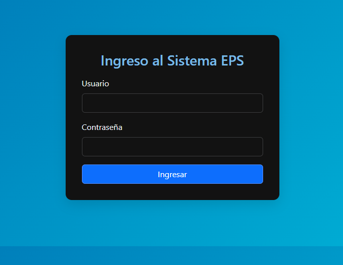
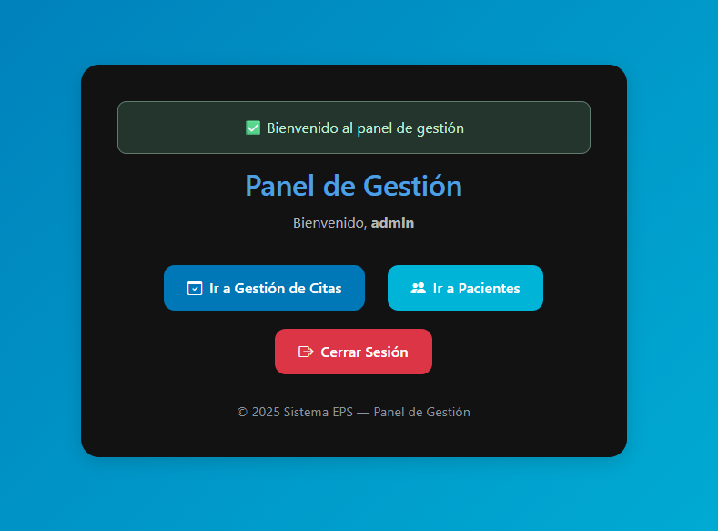
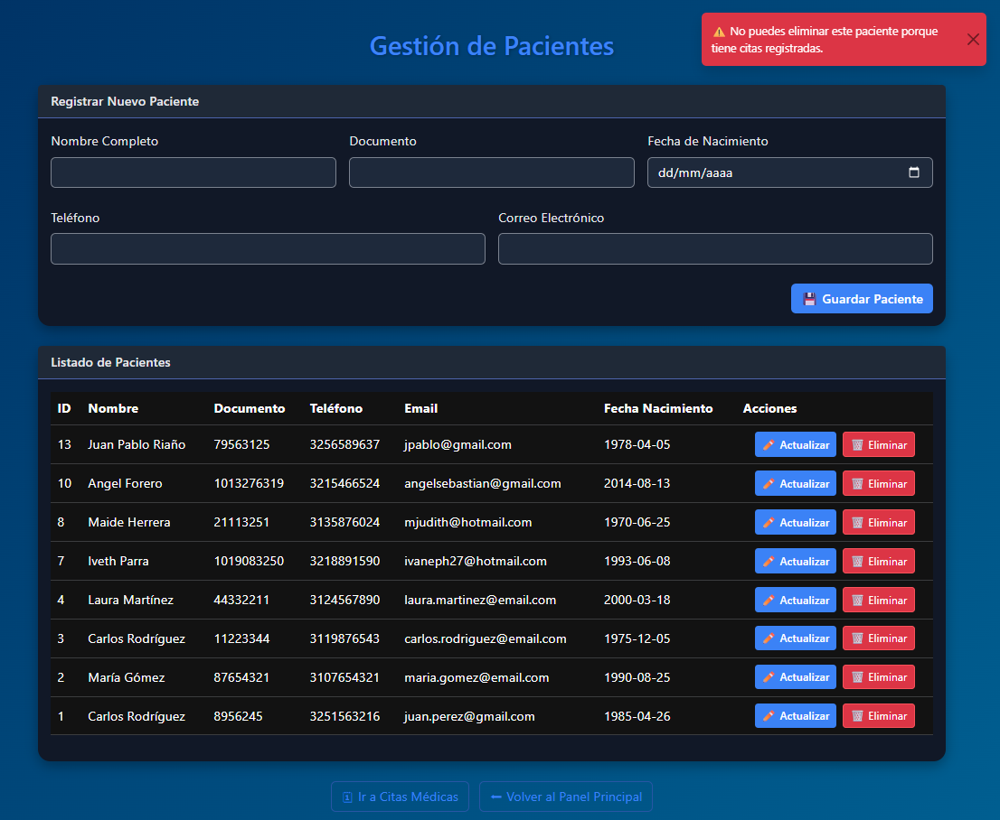
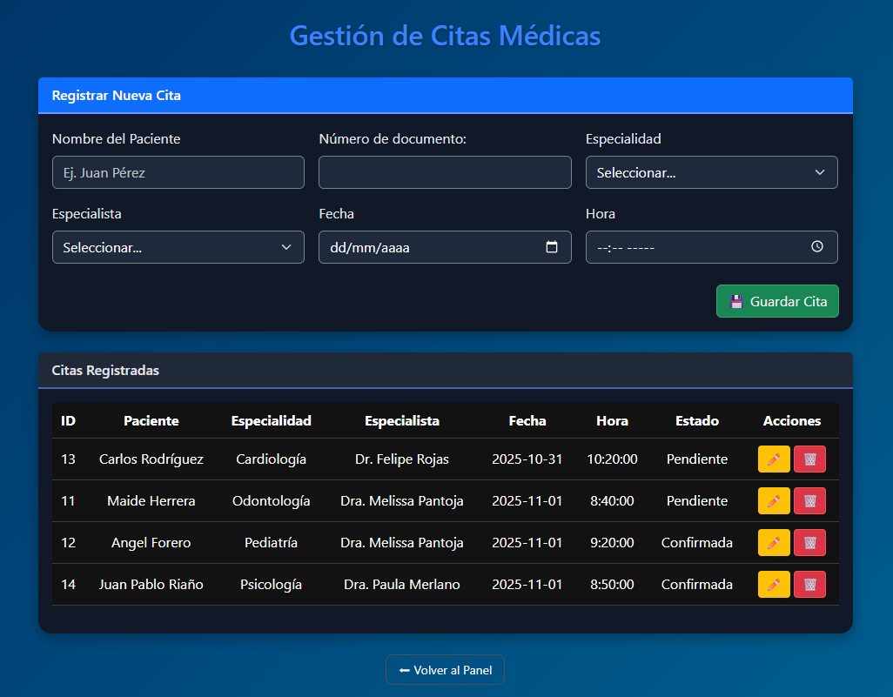
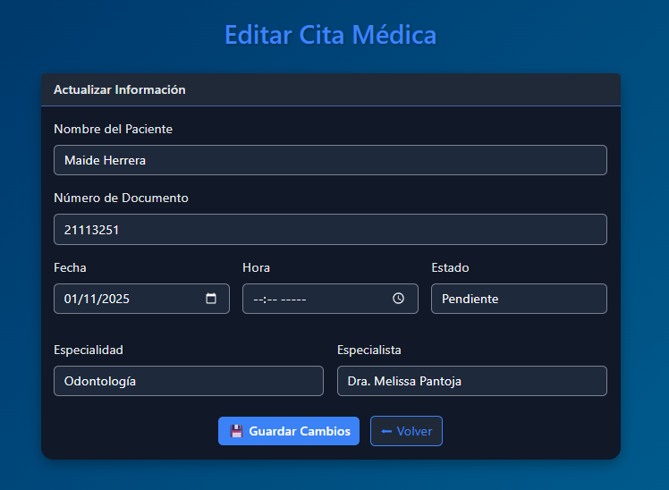
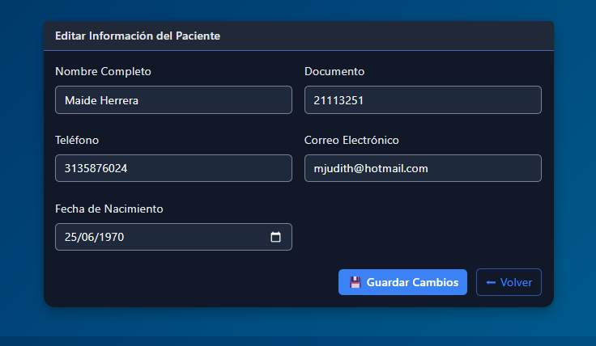
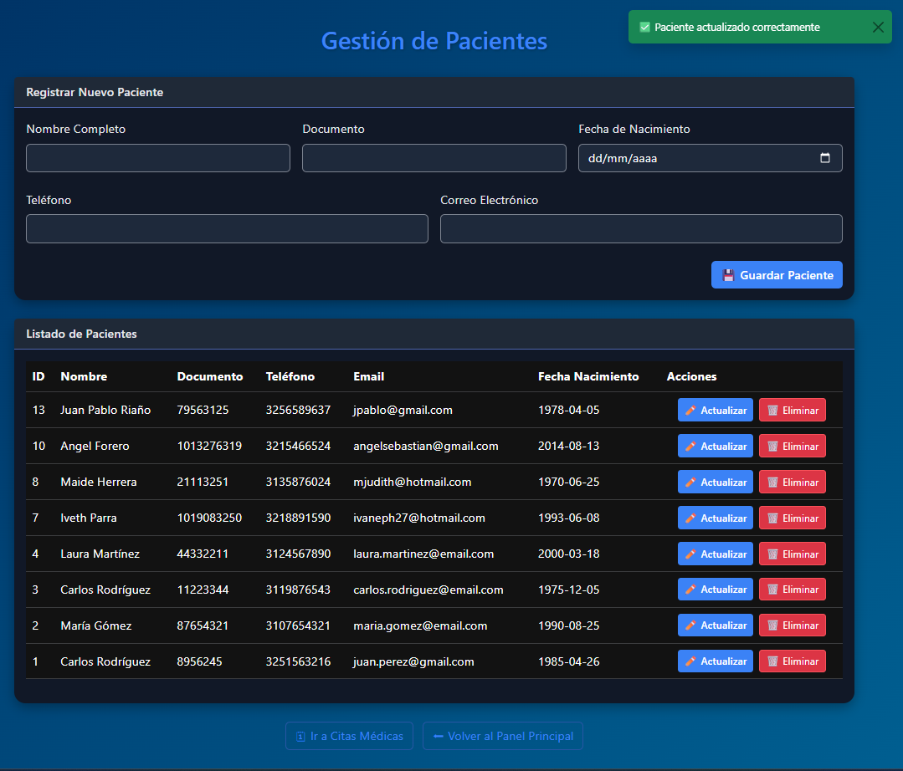
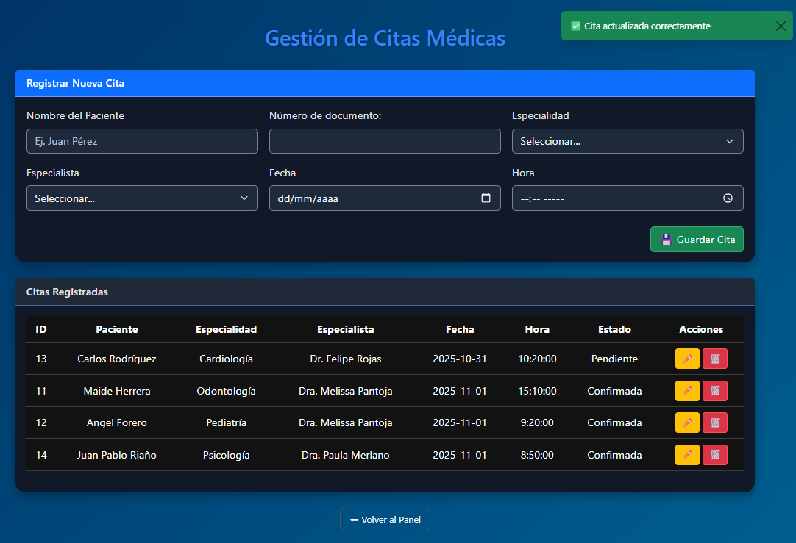
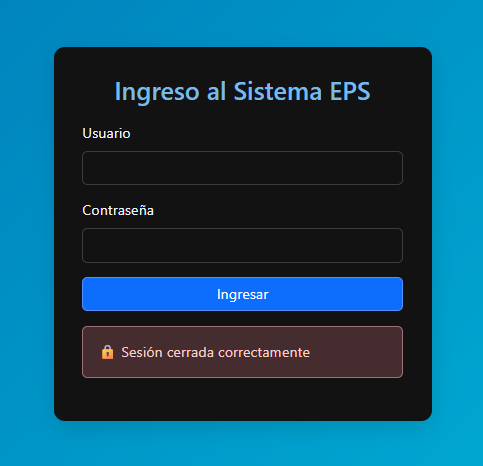

<h1 align="center">🏥 Gestor de Citas Médicas</h1>
<p align="center"><em>Proyecto completo con Flask y MySQL🩺</em></p>

<p align="center">
  
  
  
  
  
</p>

---

## 🩺 Descripción del Proyecto

El **Gestor de Citas Médicas** es una aplicación web desarrollada con **Flask** y **MySQL**, que permite administrar pacientes, especialistas, especialidades y citas médicas de forma intuitiva.  

Su objetivo es brindar una solución práctica para pequeños consultorios o centros médicos que deseen optimizar la gestión de citas, manteniendo una interfaz simple y funcional.

Entre sus principales características se incluyen:
- Registro, edición y eliminación de pacientes y especialistas.  
- Programación, modificación y cancelación de citas médicas.  
- Asociación de citas con pacientes y especialidades.  
- Panel de control con notificaciones y mensajes de confirmación.  
- Interfaz moderna construida con **Bootstrap 5**.

---
## ⚙️ Tecnologías Utilizadas

El proyecto fue desarrollado utilizando las siguientes herramientas y tecnologías:

| 💻 Categoría | 🧩 Tecnologías |
|--------------|----------------|
| **Backend** | 🐍 Flask (Python), 🗄️ MySQL |
| **Frontend** | 🎨 HTML5, CSS3, 💠 Bootstrap 5, ⚡ Font Awesome |
| **Servidor local** | ⚙️ XAMPP |
| **Control de versiones** | 🌿 Git & 🐙 GitHub |
| **Entorno de desarrollo** | 🧠 Visual Studio Code |
| **Base de datos** | 🧾 MySQL Workbench |

---

## 🗂️ Estructura del proyecto

```bash
proyecto_estrella/
│
├── app.py # 🧠 Archivo principal de la aplicación Flask
├── requirements.txt # 📦 Dependencias del proyecto
│
├── static/ # 🎨 Archivos estáticos (CSS, JS, imágenes)
│ ├── css/
│ ├── js/
│ └── img/
│
├── templates/ # 🧩 Plantillas HTML (vistas del sistema)
│ ├── index.html
│ ├── pacientes.html
│ ├── citas.html
│ ├── editar_paciente.html
│ └── editar_cita.html
│
└── README.md # 📘 Documentación principal del proyecto
```


---

## 🚀 Instalación y Ejecución

Sigue estos pasos para clonar y ejecutar el proyecto en tu entorno local:

### 1️⃣ Clonar el repositorio
```bash
git clone https://github.com/iparra-sys/proyecto_estrella.git
cd proyecto_estrella
```
2️⃣ Crear y activar un entorno virtual
En Windows:
```bash
python -m venv venv
venv\Scripts\activate
```
En Linux / macOS:
```bash
python3 -m venv venv
source venv/bin/activate
```
3️⃣ Instalar dependencias
```bash
pip install -r requirements.txt
```
4️⃣ Configurar la base de datos
Asegúrate de tener un servidor MySQL en ejecución y crea una base de datos llamada:
```
CREATE DATABASE gestion_citas;
```
Luego, actualiza las credenciales en el archivo app.py:
```
app.config['MYSQL_HOST'] = 'localhost'
app.config['MYSQL_USER'] = 'root'
app.config['MYSQL_PASSWORD'] = ''
app.config['MYSQL_DB'] = 'gestion_citas'
```
5️⃣ Ejecutar la aplicación
```bash
python app.py
```
La aplicación estará disponible en tu navegador en: 👉 http://127.0.0.1:5000/

----

## ⚙️ Funcionalidades Principales

El **Sistema de Gestión de Citas Médicas** permite administrar de forma intuitiva la programación y control de pacientes, especialistas y citas médicas.

### 🩺 Módulos principales
- **Gestión de Pacientes:** registro, edición, búsqueda y eliminación de pacientes.  
- **Gestión de Especialistas:** administración del personal médico con especialidad asignada.  
- **Gestión de Especialidades:** definición de las áreas médicas disponibles.  
- **Gestión de Citas Médicas:** creación, actualización y seguimiento del estado de las citas (pendiente, completada o cancelada).  

### 💬 Notificaciones visuales
- Sistema de alertas dinámicas con **toasts** Bootstrap para confirmar acciones o mostrar errores de validación.

### 🔍 Búsqueda y control
- Listados interactivos con filtros y botones de acción para editar o eliminar registros fácilmente.

### 🧩 Diseño modular
- Separación de responsabilidades por rutas y plantillas HTML organizadas para mantener el código limpio y escalable.

### 🖥️ Interfaz moderna y adaptable
- Construida con **Bootstrap 5**, íconos **Font Awesome** y una estructura responsive que se adapta a cualquier dispositivo.

---
## 👀 Vista Previa de la App

A continuación se muestran algunas capturas de pantalla del sistema en funcionamiento:

### 🔐 Pantalla de Login


### 🏠 Inicio del Sistema


### 👨‍⚕️ Gestión de Pacientes


### 🗓️ Gestión de Citas Médicas


### ✏️ Editar Cita


### 🔁 Actualizar Paciente


### ✅ Confirmación al Actualizar


### ✅ Confirmación al Editar Cita


### 🚪 Cierre de Sesión


💡 Estas imágenes muestran la interfaz del sistema y las principales funcionalidades de gestión de citas, pacientes y control de sesiones.


---

## 🚀 Próximas Mejoras

💡 Estas son algunas funcionalidades planeadas para próximas versiones:

- [ ] 📧 Integrar sistema de **notificaciones por correo** para recordatorios de citas  
- [ ] 📱 Mejorar la **experiencia móvil** con diseño responsive  
- [ ] 🔍 Implementar **filtros avanzados** para búsqueda de citas y pacientes  
- [ ] 📄 Añadir opción de **exportar reportes** en PDF o Excel  
- [ ] 🔐 Incorporar **autenticación con redes sociales** (Google, Facebook)  
- [ ] 📊 Agregar **historial de citas** con estadísticas y gráficas  
- [ ] ⚡ Optimizar la **velocidad de carga** y el rendimiento de la app  
- [ ] 🌙 Implementar **tema oscuro** para comodidad visual


---
## 👩‍💻 Autora

**Iveth Parra Herrera**  
💡 *“El código es una herramienta para construir soluciones reales y dejar huella.”*  

✨ Proyecto desarrollado como parte del Portafolio 2025 - Iveth Parra Herrera ✨

---

## 📄 Licencia

Este proyecto se publica con fines educativos y de portafolio.
Eres libre de revisarlo, mejorarlo o inspirarte en su estructura.


